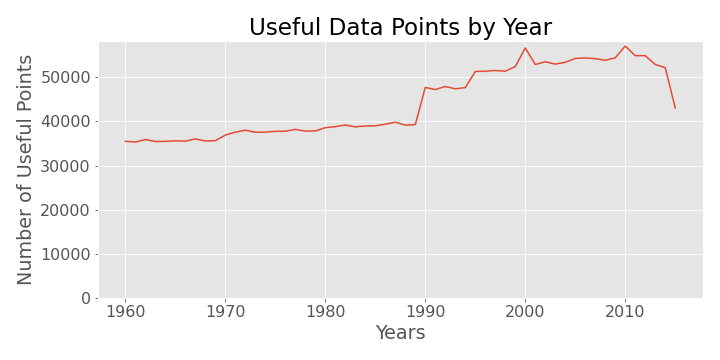

# Our First Case Study
For our dataset, we chose to examine data compiled by the World Bank on indicators, such as immunization rates, malnutrition prevalence, and vitamin A supplementation rates across 263 countries around the world. The available data spans 345 indicators collected from 1960-2016.

Because it is such a large dataset, we first wanted to examine the integrity of the data by year. We suspected that the dataset would be more complete in more recent years. Figure 1, below, shows the number of useful (non-null) data points for each year. It shows that, indeed, the dataset grew more complete across time.

<code>
    health = pd.read_csv('data/data.csv')
    years = health.columns[4:-1]
    health_columns = np.array(health.count(axis=0))[4:-1]
    fig, ax = plt.subplots(figsize=(10, 5))  
    ax.plot(years, health_columns)
    ax.set_title('Useful Data Points by Year')
    ax.set_xlabel('Years')
    ax.set_ylabel('Number of Useful Points')
    ax.set_ylim(bottom=0)
    ax.set_xticks(years[::10])
    plt.tight_layout()
    plt.show()
    fig.savefig('figures/f1.usefuldatapointsbyyear.png')
    </code>
